# Trí Tuệ Nhân Tạo – Mô Phỏng Các Thuật Toán

## Thông tin dự án
- **Họ và tên:** [Tên sinh viên]
- **MSSV:** [Mã số sinh viên]
- **Ngày:** [Ngày tháng năm]

Dự án này là tập hợp các mô phỏng trực quan, có đồ họa dành cho các thuật toán AI. Giao diện trực quan giúp người dùng theo dõi và hiểu rõ từng bước chạy của các thuật toán trong nhiều bài toán khác nhau, chủ yếu tập trung vào:
- **Bài toán Máy Hút Bụi (Vacuum Cleaner):** Môi trường lưới để các đặc vụ (agent) dọn dẹp bụi bẩn.
- **Bài toán Thỏa mãn Ràng buộc (CSP) - Tô màu bản đồ:** Giải quyết việc gán màu cho các khu vực sao cho không có hai khu vực liền kề cùng màu (ví dụ: bản đồ các quận/huyện TP.HCM).
- **Trò chơi đối kháng (Tic-Tac-Toe):** Ứng dụng thuật toán tìm kiếm đối kháng để tìm nước đi tối ưu.

## Các Nhóm Thuật Toán Được Áp Dụng

Dưới đây là danh sách các nhóm thuật toán đã được cài đặt và mô phỏng. Ở mỗi thuật toán, bạn có thể thay thế đường dẫn trong cột **Minh họa (GIF)** bằng file ảnh tương ứng để minh họa cách thuật toán đó hoạt động.

### 1. Tìm kiếm mù (Uninformed Search)
*Các thuật toán duyệt không gian trạng thái mà không có thêm thông tin đặc thù (heuristic) nào về chi phí tới đích.*

| Thuật toán | Minh họa (GIF) | Mô tả ngắn |
| :--- | :---: | :--- |
| **Tìm kiếm theo chiều rộng (BFS)** | 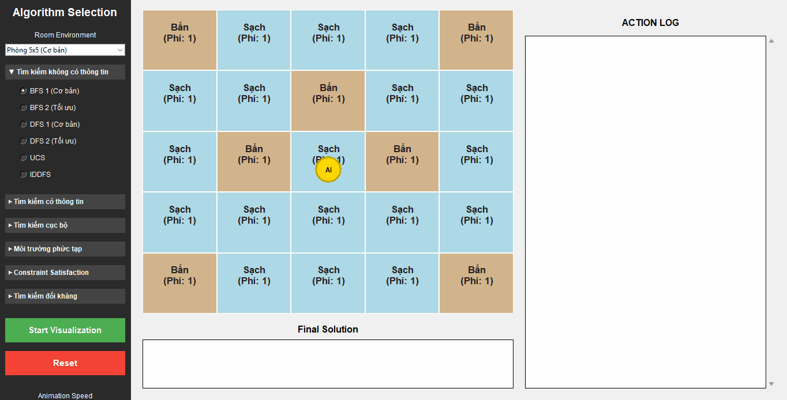 | Mở rộng các nút nông nhất trước. Đảm bảo tìm được đường đi ngắn nhất (số bước ít nhất). |
| **Tìm kiếm theo chiều sâu (DFS)** | 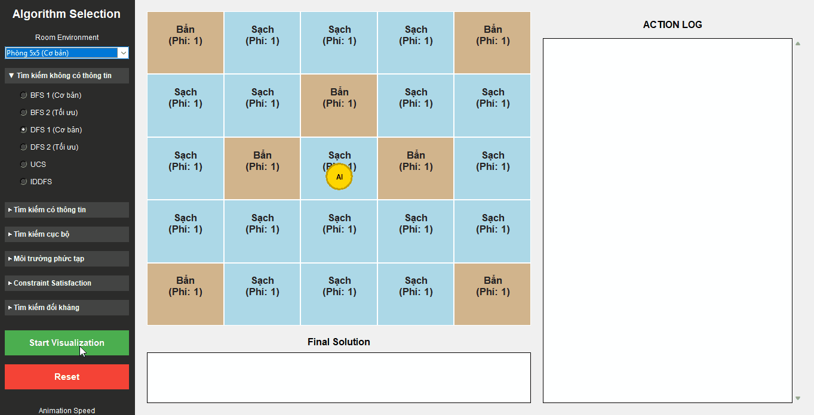 | Đi sâu vào từng nhánh trước khi quay lui. Phù hợp cho không gian lớn nhưng có thể bị kẹt. |
| **Tìm kiếm sâu dần (IDDFS)** | 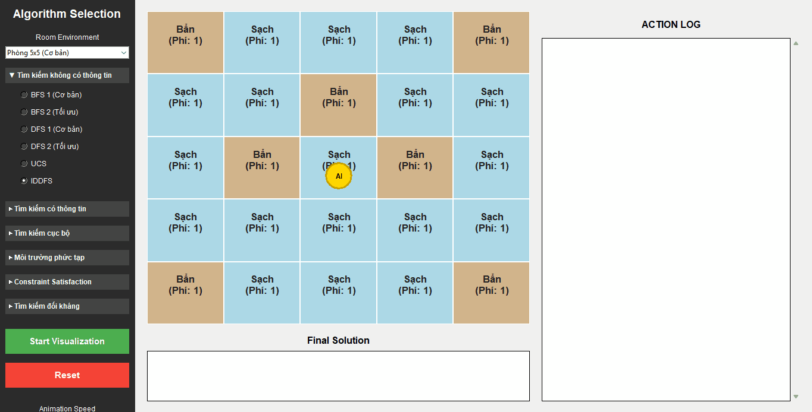 | Kết hợp ưu điểm của BFS (tối ưu) và DFS (tiết kiệm bộ nhớ) bằng cách giới hạn độ sâu lặp lại. |
| **Tìm kiếm chi phí đồng nhất (UCS)** | 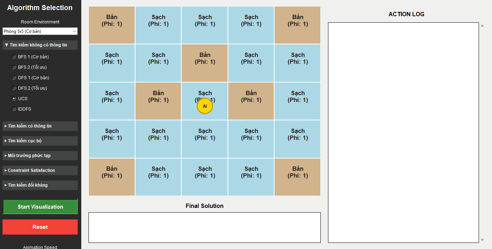 | Luôn mở rộng nút có đường đi từ trạng thái đầu với chi phí thấp nhất. |

### 2. Tìm kiếm có thông tin (Informed Search)
*Các thuật toán sử dụng hàm heuristic để ước lượng khoảng cách/chi phí tới đích, giúp hướng dẫn quá trình tìm kiếm thông minh hơn.*

| Thuật toán | Minh họa (GIF) | Mô tả ngắn |
| :--- | :---: | :--- |
| **Tìm kiếm A* (A-Star)** | 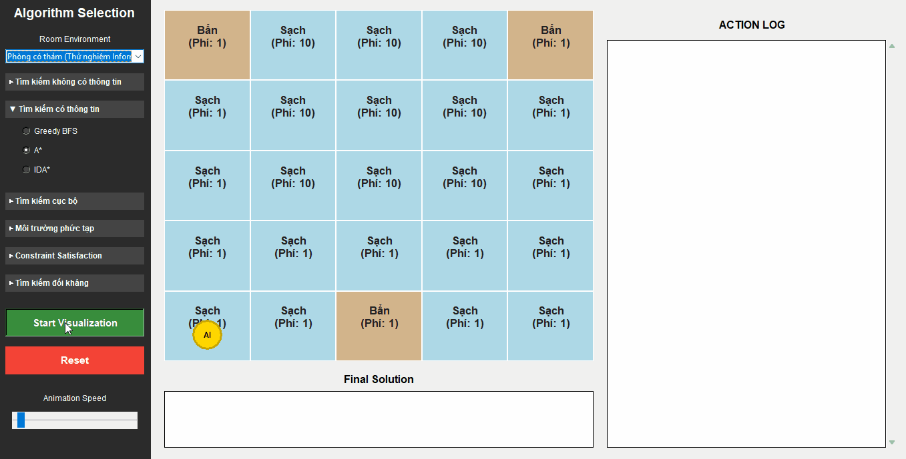 | Kết hợp chi phí thực tế (g) và chi phí ước lượng (h) để tìm đường đi tối ưu hiệu quả. |
| **Tìm kiếm tham lam (GBFS)** | 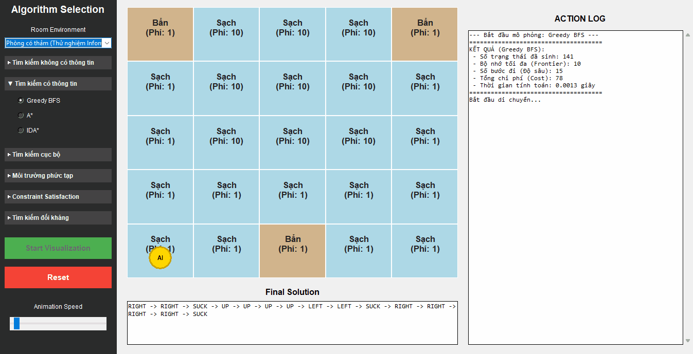 | Chỉ dựa vào hàm heuristic (h) để tiến tới đích nhanh nhất nhưng không đảm bảo tối ưu. |
| **A* sâu dần (IDA*)** | 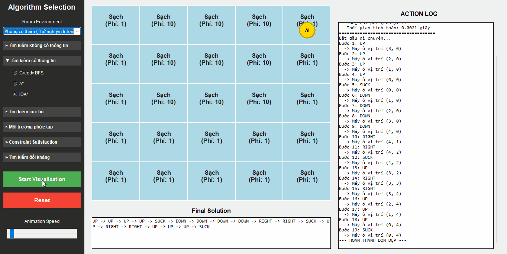 | Phiên bản tiết kiệm bộ nhớ của A*, sử dụng giới hạn chi phí thay vì giới hạn độ sâu. |

### 3. Tìm kiếm cục bộ (Local Search)
*Khởi tạo từ một trạng thái ngẫu nhiên và cải thiện trạng thái hiện tại bằng cách di chuyển đến các trạng thái lân cận tốt hơn.*

| Thuật toán | Minh họa (GIF) | Mô tả ngắn |
| :--- | :---: | :--- |
| **Leo đồi đơn giản (Simple Hill Climbing)** | 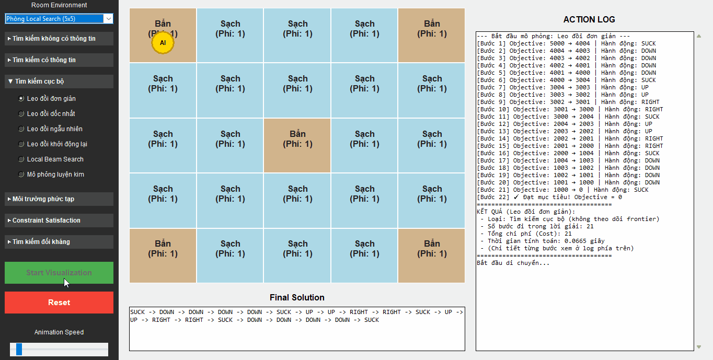 | Đánh giá từng lân cận và di chuyển ngay đến trạng thái đầu tiên tốt hơn hiện tại. |
| **Leo đồi dốc nhất (Steepest-Ascent Hill Climbing)** | 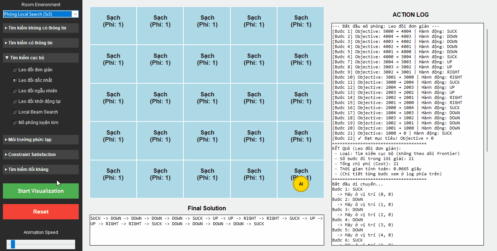 | Đánh giá tất cả lân cận và chọn trạng thái tốt nhất. Vẫn dễ kẹt ở cực đại cục bộ. |
| **Leo đồi ngẫu nhiên (Stochastic Hill Climbing)** | 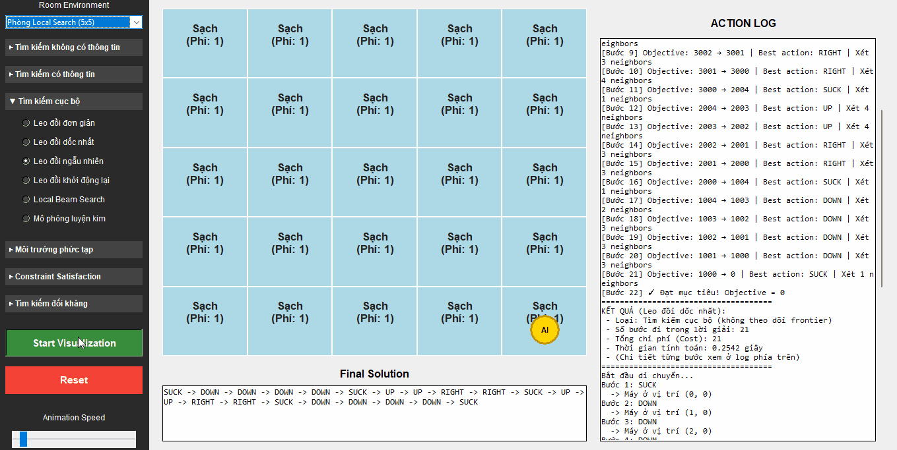 | Chọn ngẫu nhiên một trong số các trạng thái lân cận tốt hơn trạng thái hiện tại. |
| **Leo đồi khởi động lại ngẫu nhiên (Random-Restart Hill Climbing)** | 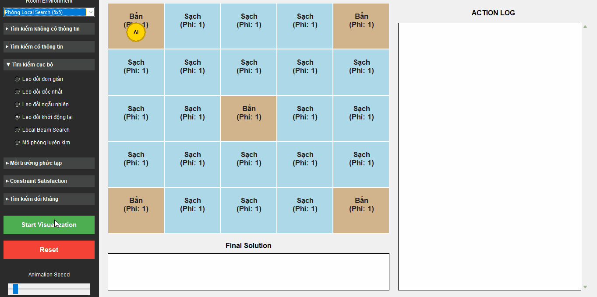 | Thực hiện leo đồi nhiều lần từ các trạng thái xuất phát ngẫu nhiên khác nhau. |
| **Tìm kiếm chùm cục bộ (Local Beam Search)** |  | Duy trì k trạng thái tốt nhất thay vì 1, cho phép khám phá không gian rộng hơn. |
| **Tôi luyện mô phỏng (Simulated Annealing)** |  | Cho phép di chuyển đến trạng thái xấu hơn ở giai đoạn đầu để tránh kẹt ở cực đại cục bộ. |

### 4. Môi trường phức tạp (Complex Environments)
*Các thuật toán giải quyết bài toán trong môi trường không xác định, không quan sát được hoàn toàn hoặc không có cảm biến.*

| Thuật toán | Minh họa (GIF) | Mô tả ngắn |
| :--- | :---: | :--- |
| **And-Or Search** |  | Cây tìm kiếm xử lý các hành động không xác định (Non-deterministic) với các nút AND và OR. |
| **Belief State Search** | 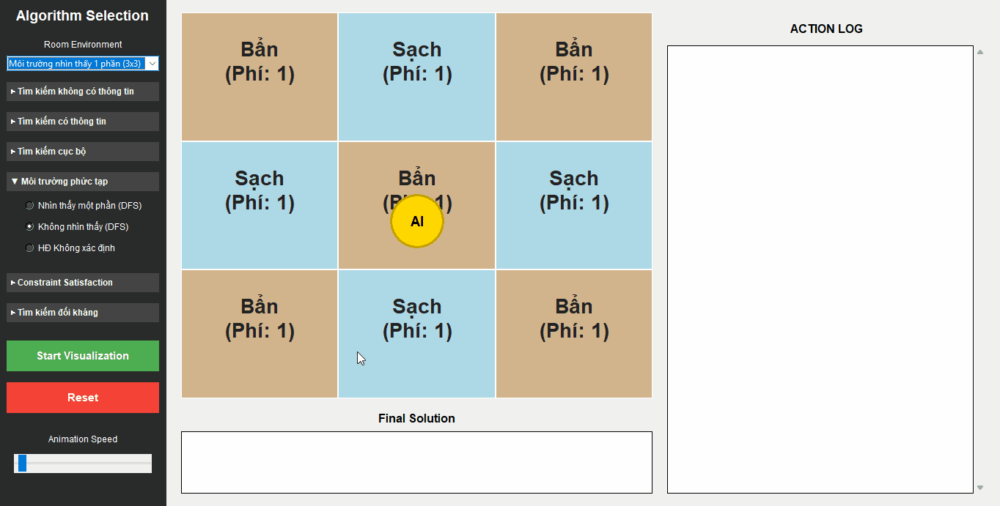 | (Sensorless) Tác tử suy đoán tập hợp các trạng thái có thể xảy ra và hành động để thu hẹp chúng. |
| **Partially Observable DFS** | 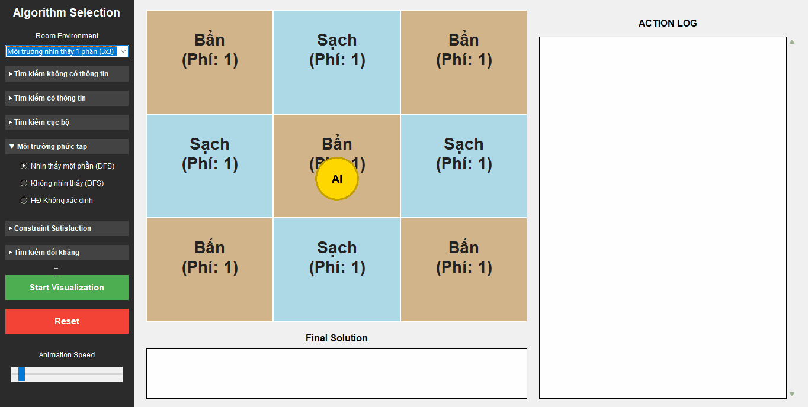 | Tác tử chỉ quan sát được một phần môi trường thông qua các cảm biến cục bộ. |

### 5. Bài toán Thỏa mãn Ràng buộc (CSP)
*Biểu diễn trạng thái dưới dạng các biến có miền giá trị và tìm phép gán thỏa mãn tất cả các ràng buộc.*

| Thuật toán | Minh họa (GIF) | Mô tả ngắn |
| :--- | :---: | :--- |
| **Tìm kiếm quay lui (Backtracking)** | 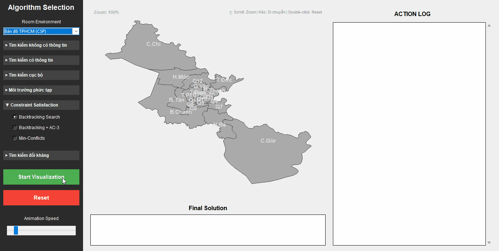 | Thử gán giá trị cho từng biến và quay lui nếu vi phạm ràng buộc. |
| **AC-3 (Arc Consistency)** |  | Lan truyền các ràng buộc để loại bỏ các giá trị không hợp lệ trong miền giá trị của biến. |
| **Min-Conflicts** | 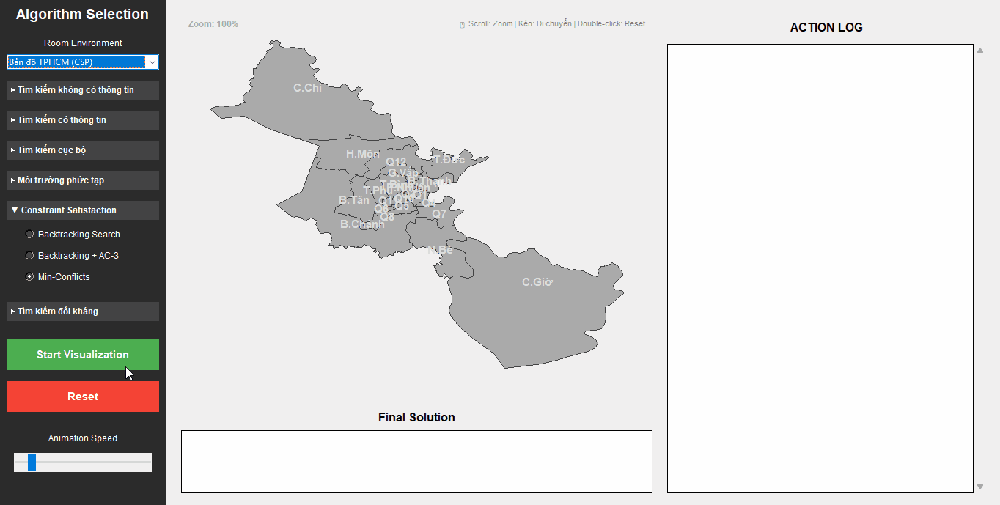 | Khởi tạo cấu hình ban đầu ngẫu nhiên, sau đó thay đổi giá trị của biến để giảm thiểu số ràng buộc bị vi phạm. |

### 6. Tìm kiếm đối kháng (Adversarial Search)
*Được sử dụng trong các trò chơi (như Tic-Tac-Toe) có tính cạnh tranh, tìm nước đi tối ưu khi đối thủ cũng tối ưu hóa.*

| Thuật toán | Minh họa (GIF) | Mô tả ngắn |
| :--- | :---: | :--- |
| **Minimax** | 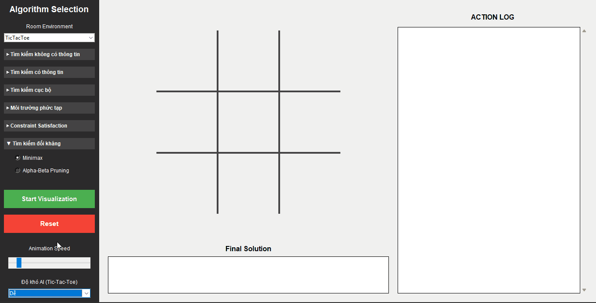 | Duyệt cây trò chơi, một người chơi cố gắng tối đa hóa điểm số, người kia cố gắng tối thiểu hóa. |
| **Cắt tỉa Alpha-Beta (Alpha-Beta Pruning)** |  | Bản tối ưu của Minimax, cắt bỏ các nhánh con không cần thiết (không thể ảnh hưởng đến kết quả) để duyệt nhanh hơn. |
| **Expectimax** | 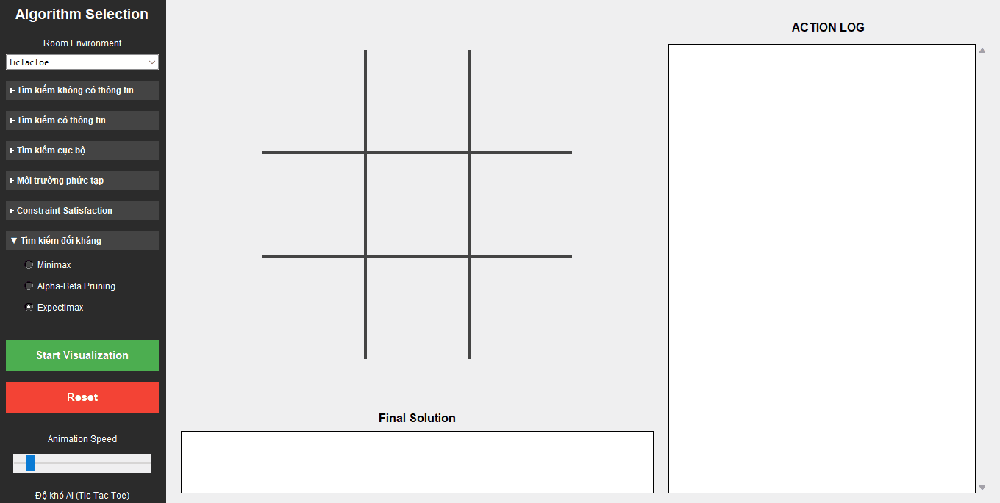 | Biến thể của Minimax dành cho các trò chơi có yếu tố ngẫu nhiên (chances), sử dụng giá trị kỳ vọng (expected utility) thay vì giá trị tối thiểu. |

---

## 🚀 Cách thêm GIF của bạn

1. Tạo hoặc sử dụng thư mục có tên `docs/` trong dự án.
2. Lưu các file ảnh chụp luồng chạy (định dạng `.gif`) vào thư mục này.
3. Trong bảng trên, hãy sửa lại đường dẫn trong các thẻ `` cho trùng với tên file thực tế của bạn.
4. Bạn cũng có thể điều chỉnh hoặc thêm các mô tả ngắn tương ứng nếu muốn rõ ràng hơn.

## 🛠️ Cách chạy dự án

```bash
# Chạy giao diện mô phỏng chính
python main.py
```
